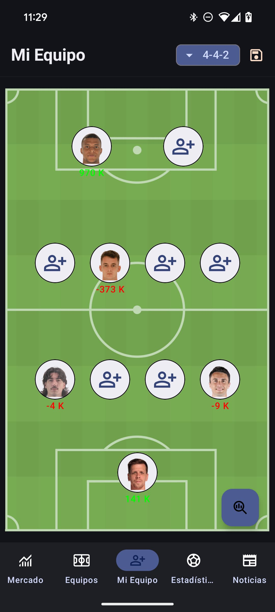
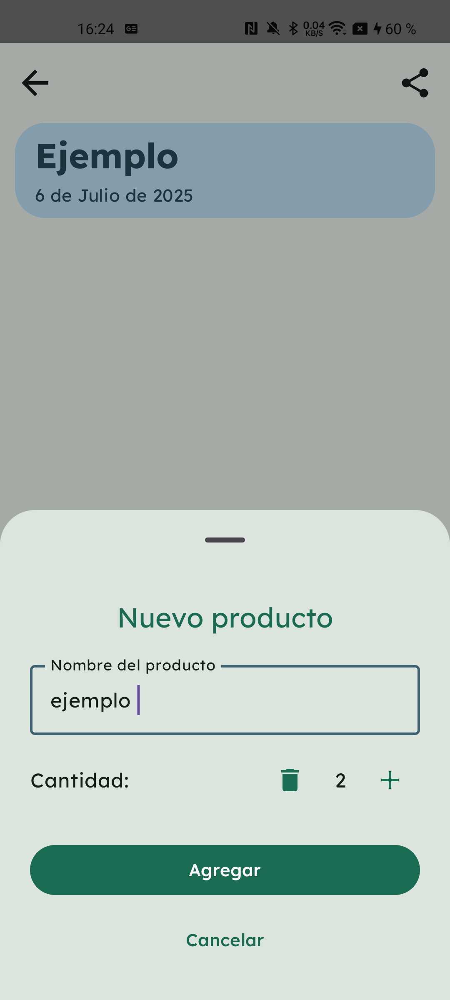

# 💼 Victor Cioffi — Personal Portfolio

Welcome to my personal portfolio repository! I'm Victor, a Software Engineer specialized in Mobile Development. Here you'll find a showcase of my personal and professional projects, with details about the tech I love working with and the platforms I build for.

---

## 👨‍💻 About Me

I’m a mobile developer with over 3 years of experience building apps for a wide range of platforms including mobile, tablet, Chromecast, and Smart TVs.

I work mainly with Android and Kotlin Multiplatform, with a solid understanding of iOS as well. I’m passionate about clean architecture, modern mobile development practices, and delivering performant, scalable apps that reach millions of users.

- 📍 Based in: Leganés, Madrid (Spain)
- 📧 Email: [vcioffir@gmail.com](mailto:vcioffir@gmail.com)
- 🔗 LinkedIn: [linkedin.com/in/víctor-cioffi](https://www.linkedin.com/in/v%C3%ADctor-cioffi-2894aa223/)

---

## 🚀 Projects

### ⚽📊 FantasyMarket

A Kotlin Multiplatform application that provides stats and insights for football fantasy apps, available for both Android and iOS.

**Features:**
- Scrapes fantasy football data and provides user insights
- Uses Firebase, Firestore, Analytics, Room DB, and MySQL backend
- Architecture: MVVM, Clean Architecture
- Dependency injection with Koin
- Built with Compose, Coroutines, Flows

**Status:** ⚡ Updating  
**Tech Stack:** Kotlin Multiplatform, Firebase, MySQL, Room, SQLite, Compose, Koin, Coroutines

### 🧩 FantasyMarket Screenshots

  
  &nbsp;
  
  &nbsp;
  
  &nbsp;
  

 

  
  &nbsp;
  
  &nbsp;
  
  &nbsp;
  

 

  
  &nbsp;
  
  &nbsp;
  
  &nbsp;
  

---

### 🛍️ SharedShop

A modern Android application built with Jetpack Compose for creating, managing, and sharing shopping lists collaboratively.

**Features:**
- Intuitive creation and management of shopping lists with categories.
- Join shared lists easily via invitation links.
- Intent filters to join lists via urls
- Real-time collaboration.
- Modern UI built entirely with Jetpack Compose.
- Widgets on Android platform to display lists
- Clean Architecture with MVVM pattern.
- User-friendly dialogs for limits, confirmations, and joining lists.
- Android and iOS support using KMP framework

**Status:** ✅ Finished  
**Tech Stack:** Android (Jetpack Compose), Kotlin, Coroutines, Flow, MVVM, Clean Architecture, Firebase, Ktor, DI: Koin, Kotlin Multiplatform

**SharedShop Screenshots:**

  
  &nbsp;
  
  &nbsp;
  
  &nbsp;
  
  &nbsp;

 

  
  &nbsp;
  
  &nbsp;
  
  &nbsp;
  
  &nbsp;

 

  
  &nbsp;
  
   &nbsp;
  
   &nbsp;
  

---

### 🎬 TheMovieHub

An Android app to browse now-playing movies, search titles, save favorites, and manage watchlists.

**Features:**
- featured movies and tv shows
- Browse movies in theaters and search into the TMDB database
- Save to favorites, create a watchlist and watched list
- Clean architecture with MVVM and Dagger Hilt
- Local storage using Room and SQLite

**Status:** ✅ Published  
**Tech Stack:** Jetpack Compose, TMDB API, Retrofit, MVVM, Dagger Hilt, Room, Flow, Coroutines  
**Available on Google Play:** [TheMovieHub on Play Store](https://play.google.com/store/apps/details?id=com.vcioffi.themoviehub)

TheMovieHub Screenshots

  
  &nbsp;
  
  &nbsp;
  
  &nbsp;
  
  &nbsp;

 

  
  &nbsp;
  
  &nbsp;
  
  &nbsp;
  
  &nbsp;

 

  
  &nbsp;
  
  &nbsp;
  
  &nbsp;
  
  &nbsp;

 

---

## 📸 More Projects

> Stay tuned! More personal and experimental projects will be added soon.

---

## 📬 Contact

Feel free to reach out for collaborations, ideas, or just to connect.

- 📧 [vcioffir@gmail.com](mailto:vcioffir@gmail.com)
- 💼 [LinkedIn](https://linkedin.com)
